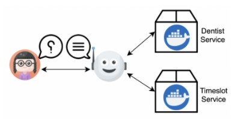
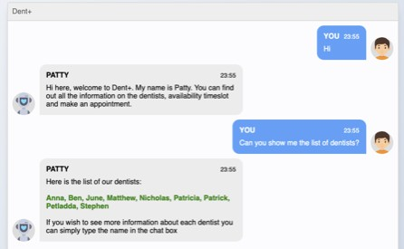
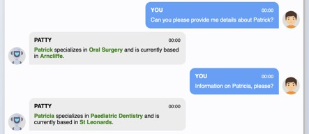

# Dent+

Patty of Dent+ is a chatbot that relies on a set of REST API based micro-services to perform booking in a dental clinic. The patient here is the patient contact Patty to request for a booking. If the patient needs to specify the doctor or asks for the list of doctors available.

## System overview



## Setup with Docker setup

### Dentist service

Navigate to the **dentist** service folder, there is the Dockerfile. Follow the below commands to get the service up and running.

```
$ cd dentist
$ docker build -t dentist .
$ docker run -p 8000:8000 -t dentist:latest __init__.py
```

### Timeslot service

Navigate to the **timeslot** service folder, there is a Dockerfile. Follow the below commands to get the service up and running.

```
$ cd timeslot
$ docker build -t timeslot .
$ docker run -p 4000:4000 -t timeslot:latest __init__.py
```

## Setting up Chatbot Service
Navigate to the **chatbot** service folder. Follow the below commands to get the service up and running.

```
$ cd chatbot
$ cd app
$ pip3 install -r requirements.txt
$ cd demo
$ python3 __init__.py
```

## Setting up Frontend service
Navigate to the **frontend** service folder. Follow the below commands to get the service up and running.

```
$ cd frontend
$ npm install
$ npm run start
```

## API Documentation

Below are the swagger documents for dentists, timeslots and chatbot services. Note: the app/docker container has to be running prior to visiting these links.

- [Dentist Service](http://127.0.0.1:8000/static/swagger-ui/index.html)
- [Timeslot Service](http://127.0.0.1:4000/static/swagger-ui/index.html)
- [Chatbot Service](http://127.0.0.1:5000/static/swagger-ui/index.html)

## App Preview


